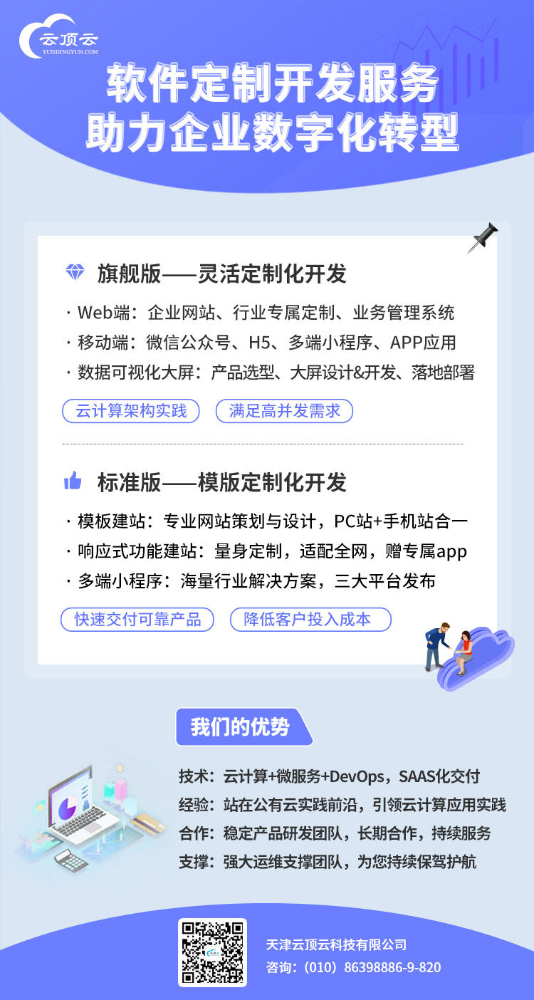

# 软件定制开发服务

突如其来的疫情让我们感受了企业在线化的优势和必要性，经济不确定性带给企业经营的压力让我们更加理解降本增效的势在必行。借助新 IT技术，将业务搬至线上，实现业务的持续经营，克服地域、空间的障碍；借助软件的力量，将重复的、劳动密集型的业务实现自动化，即降低成本，又提高效率，还可以抗击疫情带来的人员无法到岗的压力。

为此，云顶云作为华北区域领先的云计算服务商，依托自身对云计算技术的深厚积累，基于阿里云优异产品、技术的支撑，推出软件定制开发服务，旨在助力企业数字化转型。鉴于不同企业需求的特点，特推出旗舰版和标准版两套服务，供企业客户按需选择，实现投入和收益的兼顾。

## 旗舰版

针对企业的业务特点，从底层架构到产品设计，再到业务流程再造，都依据客户的需求实现量身定制。本服务的优势在于，充分发挥公有云技术的优势，能满足大并发、大数据量、用户分散等严苛场景的需求。

* 基于Spring Cloud、VUE、Node.js、Typescript、Webpack、Flutter、Docker、Kubernetes、OpenAPI等基础技术构建应用
* 基于OAuth 2、HTTPS、云盾等保障企业信息安全
* 基于Flowable等实现业务流程的灵活
* 基于DevOps、Scrum、PMP、NPDP等方法保障产品研发的高效实施

## 标准版

针对企业需要低成本业务上线、快速验证商业模式的特点，提供基于模板的定制化服务，从业务网站到小程序均可支持。本服务的优势在于低成本快速交付，可兼顾绝大多数常见行业和业务场景。

